# Selected application map

<!-- Generated by map/render.py; edit firmware.json. -->

Original KeyStep 37; not KeyStep 37 mk2; firmware **1.1.6.579**.

Selected application paths only. Recovered labels are provisional. Hash matches verify identity, not behavioral claims or device acceptance.

61 nodes, 55 relationships, 154 hashed identity windows. No firmware payload or disassembly is embedded.

See [call graph](calls.mmd), [format](FORMAT.md), [architecture](../docs/architecture.md), [sequencer route](../docs/sequencer.md), and [arpeggiator route](../docs/arpeggiator.md).

All code addresses are even instruction addresses. RAM object/data addresses, flash tables, and odd Thumb pointers are different kinds. RAM entries are supported by code/literal references in the supplied image; the checker does not read device RAM.

| Address | Kind | Provisional name | Status | Meaning |
|---|---|---|---|---|
| `0x08004000` | flash_data | `application_vectors` | confirmed_static | Application vector table. Initial SP is 0x2000c000; this does not establish total SRAM or safe stack usage. |
| `0x0801d310` | function | `reset_handler` | confirmed_static | Copies initialized data, clears the original zero-initialized range, then calls platform, constructor runtime and application entry. Memory added by extensions requires explicit initialization and heap separation. |
| `0x080150d0` | function | `application_setup_and_loop` | confirmed_static | Contains setup and the main polling loop; loop labels are not separate callable functions. |
| `0x08015768` | code_label | `application_loop_head` | confirmed_static | Internal main-loop label. USB parsing and sequence servicing recur within one pass; elapsed main service is not proof that IRQ producers are idle. |
| `0x200023f8` | ram_object | `midi_transport_object` | confirmed_static | Transport object with USB byte ring, serial parser and a separate serial-message copy ring. Published through global 0x200010e0 after construction. |
| `0x0801e9a8` | flash_data | `midi_transport_vtable` | confirmed_static | Vtable data at a flash address. Its first entry is Thumb pointer 0x08010255, whose instruction address is 0x08010254. |
| `0x08015094` | function | `usb_midi_input_callback` | supported | Reads the published transport object, then decodes received USB-MIDI packets when it exists. |
| `0x08010638` | function | `decode_usb_midi_packets` | confirmed_static | Unpacks USB-MIDI CIN groups into a byte ring. Capacity checks can drop data before the accepted-message boundary. |
| `0x0800fa64` | function | `process_usb_midi_ring` | confirmed_static | Consumes at most 50 bytes per invocation, supports running status and separately handles real-time messages. Return does not imply the ring is empty. |
| `0x08010254` | function | `receive_parsed_midi` | confirmed_static | Parsed-message subscriber: origin, transport selection and channel filtering precede note routing. |
| `0x08018624` | function | `serial_midi_irq37` | confirmed_static | UART receive IRQ can call the serial byte parser before returning from IRQ context. |
| `0x0800fd5c` | function | `parse_serial_midi_byte` | confirmed_static | Serial MIDI parser invoked from UART IRQ; input handling is not exclusively in the main loop. |
| `0x08010310` | code_label | `input_channel_prefilter_source_preserved` | confirmed_static | Internal label before channel filtering while source 0=USB or 1=DIN remains available. This is earlier than the pitch-only tracker. |
| `0x0801b750` | function | `process_received_notes` | supported | Note processing entry used by scanner and MIDI. r2 is 0 for scanner and 1 for both MIDI ports; it does not distinguish USB from DIN. |
| `0x20001ebc` | ram_object | `raw_input_pitch_serial_tracker` | confirmed_static | Tracker embedded at note object +4: pitches from sources and channels merge into the same slots. Empty selected pitch is not global absence of held notes. |
| `0x0801c4ca` | function | `update_pitch_serial_and_selection` | confirmed_static | Updates serial/velocity by pitch. A release clears that pitch without source/channel reference counts. |
| `0x0800cc48` | function | `scan_keyboard_contacts` | confirmed_static | Physical keyboard contact scanner; feeds the common note input. A raw contact release must not erase an independently accepted MIDI owner. |
| `0x20002c4c` | ram_object | `sequence_state_object` | confirmed_static | State object with current and pending block pointers. It is not the step array and is not a function pointer. |
| `0x20002e94` | ram_data | `sequence_block_slot0` | confirmed_static | Slot 0 example of eight 0x408-byte sequence blocks. 64 steps by 8 voices by 2 bytes, followed by an 8-byte header. No vtable is established for these blocks. |
| `0x200027e4` | ram_data | `working_sequence_block` | confirmed_static | Working phrase selected at startup and owned by native builder/mode paths. It is not an available scratch block. |
| `0x20002bec` | ram_object | `sequence_controller` | confirmed_static | Scheduler object with cached length, timing state, division requests and separate block/rebuild requests. Field knowledge is partial. |
| `0x20004ed4` | ram_object | `sequence_step_consumer` | confirmed_static | Playback object points to sequence state and retains the emitted pitches/channel for Note Off. Reinitializing it can discard note ownership. |
| `0x080129cc` | function | `service_sequence_controller` | confirmed_static | Calculates candidate/effective step, applies some pending operations, emits notes and checks gate release. Swing, retiming and transport can change the effective step. |
| `0x08011e44` | function | `read_sequence_counter` | confirmed_static | Reads the low 16 bits of the configured timer counter. These units are not milliseconds. |
| `0x08011e0c` | function | `lookup_step_divisor` | confirmed_static | Indices 0..7 return [480,240,120,60,320,160,80,40]; other indices return 120. |
| `0x08012ec0` | code_label | `selected_step_to_note_consumer` | confirmed_static | Internal BL instruction to the step consumer, after the effective index is stored. Observing this site alone does not identify a complete musical cycle. |
| `0x08013e8c` | function | `emit_sequence_step_notes` | confirmed_static | Reads voices/markers, reconciles retained notes, transforms pitch and emits Note On. In builder mode 5 an earlier branch can substitute the input step index. |
| `0x080130e8` | function | `read_step_voice_pitch` | confirmed_static | Reads current_block[16*step+2*voice]. No independent ownership or lifetime check is implied. |
| `0x080130f4` | function | `read_step_voice_velocity_flags` | confirmed_static | Reads current_block[16*step+2*voice+1]. Low seven bits are velocity; voice 0 bit 7 affects retention. |
| `0x080130cc` | function | `write_step_voice_pair` | confirmed_static | Writes a pitch/velocity pair into the current block. It does not by itself establish exclusive ownership or complete block initialization. |
| `0x08012f8e` | code_label | `compute_plain_gate_deadline` | confirmed_static | Plain gate branch: step*D + max(15,min(D-1,floor((D-1)*G/100))) for ordinary positive D/G. Swing branches require separate analysis. |
| `0x0801415c` | function | `release_sequence_step` | confirmed_static | Conditional release: examines current-block retention metadata, then sends Note Off from saved output pitches. It is not unconditional all-notes-off. |
| `0x08014258` | function | `release_saved_notes_without_step_ties` | confirmed_static | Sends saved Note Off messages without step tie checks. It does not clear the retained-request byte at consumer+0x28. |
| `0x08013934` | function | `uses_saved_retain_request` | confirmed_static | Tests current block +0x404 == 1; selects saved retention request versus per-step retention metadata. UI naming is unresolved. |
| `0x0801b6c4` | function | `accept_sequence_note_message` | supported | Receives already assembled sequence Note On and Note Off messages on the shared note object. Full downstream MIDI/CV routing is not mapped. |
| `0x08013020` | function | `set_current_sequence_block` | confirmed_static | Stores a block pointer in state+0. An aligned store does not publish all dependent timing and reader state. |
| `0x08013024` | function | `set_pending_sequence_block` | confirmed_static | Stores a block pointer in state+4; request flags are controlled separately. |
| `0x08013028` | function | `apply_pending_sequence_block` | confirmed_static | Copies pending pointer into current without copying the block or clearing pending. |
| `0x08017ed0` | function | `handle_slot_or_builder_mode` | confirmed_static | Mode-dependent handler chooses a native sequence slot or changes builder mode. A mode change can trigger delayed slot publication. |
| `0x2000063c` | ram_object | `phrase_builder` | confirmed_static | Builder uses an editable unique-pitch pool, deferred releases, PRNG and traversal state. It is not an immutable recording of rhythm or repeated notes. |
| `0x20002dfc` | ram_object | `primary_note_list` | confirmed_static | Up to 32 unique pitch/velocity pairs in insertion order, with a separate index array sorted by pitch. |
| `0x20002d0c` | ram_object | `deferred_release_pool` | confirmed_static | Holds deferred pitch removals. It is not a faithful physical-key ledger and not a backup of a phrase. |
| `0x080116e0` | function | `handle_builder_note_message` | confirmed_static | Routes accepted Note On/releases into primary or deferred pools according to hold and UI state. |
| `0x08013cdc` | function | `append_unique_pitch` | confirmed_static | Appends when capacity is available and pitch is absent; duplicate pitch does not replace its velocity. |
| `0x08013d18` | function | `remove_pitch_from_pool` | confirmed_static | Removes a pitch and compacts pairs without rebuilding the sorted index array. |
| `0x08013dac` | function | `build_ascending_pitch_indices` | confirmed_static | Rebuilds ascending-pitch indices without moving stored pairs. |
| `0x08011efc` | function | `request_phrase_rebuild` | confirmed_static | Sets controller+0x5d only when the relevant UI byte +0x0f is zero. Actual rebuild occurs during service. |
| `0x08011a1c` | function | `rebuild_current_phrase` | confirmed_static | Dispatches eight builder modes. Modes 2 and 3 already produce two distinct bidirectional orders. Writes voice 0 in the current block in place. |
| `0x0801181c` | function | `advance_builder_prng` | confirmed_static | 32-bit pseudorandom state used by native random selection and walking; distinct from a saved musical phrase. |
| `0x08011854` | function | `choose_random_pool_index` | confirmed_static | Native random pool-index selection allows repeats and does not establish a uniform distribution for every pool size. |
| `0x08011878` | function | `walk_storage_order_index` | confirmed_static | Mode 5 storage-order walk can go back, stay or advance. The stay branch does not normalize a stale index after a pool shrinks. |
| `0x0801196c` | function | `generate_random_note_batch` | confirmed_static | Mode 6 generates a batch with optional octave movement. Signed requested length must be constrained before any write. |
| `0x08012334` | function | `apply_transport_action` | confirmed_static | Native transport distinguishes Stop/reset from Pause: both disable emission, but pause state and cleanup differ. |
| `0x080185cc` | function | `increment_absolute_phase_irq30` | confirmed_static | IRQ entry participates in updating the absolute phase word; IRQ can occur between native phase reads. |
| `0x200000bc` | ram_data | `absolute_phase_word` | confirmed_static | Absolute phase RAM word read twice in the Time Div path with an intervening IRQ opportunity. |
| `0x08004930` | code_label | `accepted_control_raw_change_before_page_gate` | confirmed_static | Internal accepted raw-control-change boundary before page routing. Raw changes and quantized 7-bit changes are different events. |
| `0x08017260` | function | `dispatch_button_action` | confirmed_static | Native button router, also reachable from external transport IRQ through a guarded path. Main-loop ordering alone cannot serialize it. |
| `0x080184f0` | function | `external_transport_irq9` | confirmed_static | Guarded IRQ path can dispatch a native transport action through the button router. |
| `0x0800d26e` | function | `write_keyled_color` | confirmed_static | Encodes pixel components directly into the live DMA source buffer. Main-loop overlay ordering does not imply a coherent published frame. |
| `0x0800d1f8` | function | `submit_keyled_if_changed` | confirmed_static | Starts timer DMA when revision state differs. Ready/transfer-complete alone is not proof that all source readers have released ownership. |
| `0x0800b6ec` | function | `start_timer_dma_output` | confirmed_static | Timer DMA submission helper. Hardware register layout and reader lifetime require separate validation. |

```mermaid
%% Generated by map/render.py; edit firmware.json.
%% Solid: direct BL. Dashed: virtual dispatch or function-pointer relationship.
%% All edges are conditional; see firmware.json for the exact scope.
flowchart TD
  loop["application_loop_head<br/>0x08015768"]
  midi_vtable["midi_transport_vtable<br/>0x0801e9a8"]
  usb_callback["usb_midi_input_callback<br/>0x08015094"]
  usb_decode["decode_usb_midi_packets<br/>0x08010638"]
  usb_parser["process_usb_midi_ring<br/>0x0800fa64"]
  midi_receive["receive_parsed_midi<br/>0x08010254"]
  serial_midi_irq37["serial_midi_irq37<br/>0x08018624"]
  serial_parser["parse_serial_midi_byte<br/>0x0800fd5c"]
  note_input["process_received_notes<br/>0x0801b750"]
  input_pitch_tracker_update["update_pitch_serial_and_selection<br/>0x0801c4ca"]
  keyboard_scanner["scan_keyboard_contacts<br/>0x0800cc48"]
  service_sequence["service_sequence_controller<br/>0x080129cc"]
  read_phase_counter["read_sequence_counter<br/>0x08011e44"]
  step_divisor["lookup_step_divisor<br/>0x08011e0c"]
  step_playback["emit_sequence_step_notes<br/>0x08013e8c"]
  read_pitch["read_step_voice_pitch<br/>0x080130e8"]
  read_velocity["read_step_voice_velocity_flags<br/>0x080130f4"]
  write_cell["write_step_voice_pair<br/>0x080130cc"]
  release_step["release_sequence_step<br/>0x0801415c"]
  retain_mode["uses_saved_retain_request<br/>0x08013934"]
  note_output["accept_sequence_note_message<br/>0x0801b6c4"]
  apply_pending_block["apply_pending_sequence_block<br/>0x08013028"]
  builder_note_input["handle_builder_note_message<br/>0x080116e0"]
  note_pool_append["append_unique_pitch<br/>0x08013cdc"]
  note_pool_remove["remove_pitch_from_pool<br/>0x08013d18"]
  note_pool_sort["build_ascending_pitch_indices<br/>0x08013dac"]
  request_phrase_rebuild["request_phrase_rebuild<br/>0x08011efc"]
  rebuild_phrase["rebuild_current_phrase<br/>0x08011a1c"]
  random_note_index["choose_random_pool_index<br/>0x08011854"]
  walk_note_index["walk_storage_order_index<br/>0x08011878"]
  generate_random_phrase["generate_random_note_batch<br/>0x0801196c"]
  keyled_refresh["submit_keyled_if_changed<br/>0x0800d1f8"]
  keyled_dma_start["start_timer_dma_output<br/>0x0800b6ec"]
  loop -->|BL 0x080157ae| usb_parser
  loop -->|BL 0x080157b4| service_sequence
  usb_callback -->|BL 0x080150a4| usb_decode
  midi_receive -->|BL 0x08010326| note_input
  serial_midi_irq37 -->|BL 0x08018644| serial_parser
  note_input -->|BL 0x0801b76c| input_pitch_tracker_update
  keyboard_scanner -->|BL 0x0800cdfa| note_input
  keyboard_scanner -->|BL 0x0800d064| note_input
  note_input -->|BL 0x0801be18| builder_note_input
  note_input -->|BL 0x0801bf9c| builder_note_input
  service_sequence -->|BL 0x080129d4| read_phase_counter
  service_sequence -->|BL 0x080129e2| step_divisor
  service_sequence -->|BL 0x08012b62| rebuild_phrase
  service_sequence -->|BL 0x08012bd6| apply_pending_block
  service_sequence -->|BL 0x08012ec0| step_playback
  service_sequence -->|BL 0x08012fcc| release_step
  step_playback -->|BL 0x08013ec2| read_pitch
  step_playback -->|BL 0x08013fde| read_velocity
  step_playback -->|BL 0x0801407c| note_output
  step_playback -->|BL 0x08014118| note_output
  release_step -->|BL 0x0801421e| note_output
  step_playback -->|BL 0x08013ede| retain_mode
  release_step -->|BL 0x08014196| retain_mode
  step_playback -->|BL 0x08013f4e| walk_note_index
  builder_note_input -->|BL 0x0801170c| note_pool_append
  builder_note_input -->|BL 0x0801175a| note_pool_remove
  builder_note_input -->|BL 0x08011716| note_pool_sort
  builder_note_input -->|BL 0x0801171e| request_phrase_rebuild
  rebuild_phrase -->|BL 0x08011aca| write_cell
  rebuild_phrase -->|BL 0x08011c48| random_note_index
  rebuild_phrase -->|BL 0x08011ccc| generate_random_phrase
  keyled_refresh -->|BL 0x0800d218| keyled_dma_start
  midi_vtable -.->|Thumb pointer data| midi_receive
  usb_parser -.->|virtual call| midi_receive
```

<details>
<summary>Selected call graph</summary>



</details>

## Open work

- **Complete external-clock, resynchronization and swing semantics.** Model native Time Div request/target lifetimes, effective-step correction and IRQ-separated phase reads before broadening a playback hook.
- **Native sequence backward or ping-pong traversal.** Keep logical timing and physical storage indices separate; prove release look-ahead/ties and length-change behavior. See docs/sequencer.md.
- **Mode 5 walk index after pool shrink.** Trace all writers/resetters of builder+0x11; test stay/back/forward at N=0,1 and after removing the current last element.
- **Complete aliases and asynchronous writers of playback and LED buffers.** Extend the bounded caller/writer inventory through indirect calls, IRQ and mode changes before claiming exclusive ownership.
- **Loss-aware accepted-note history across USB/DIN/scanner lifecycles.** Track source/channel/pitch before merging and distinguish raw contacts from accepted note ownership; do not infer idle from selected=-1.
- **Exact MCU, complete memory limits and maximum interrupt/stack usage.** Establish hardware identity and measurable RAM/stack bounds. Reset SP and local successful probes do not establish free memory or universal recovery.

## Reproduction

```sh
python3 map/render.py --check
python3 map/check.py --firmware "$KS37_STOCK"
```

The first command detects stale generated files. The second requires the exact, locally supplied firmware profile, verifies the application digest and all short windows, and decodes direct-call targets. Neither command proves execution, safety, complete control flow, or the semantic interpretation of neighboring instructions.
